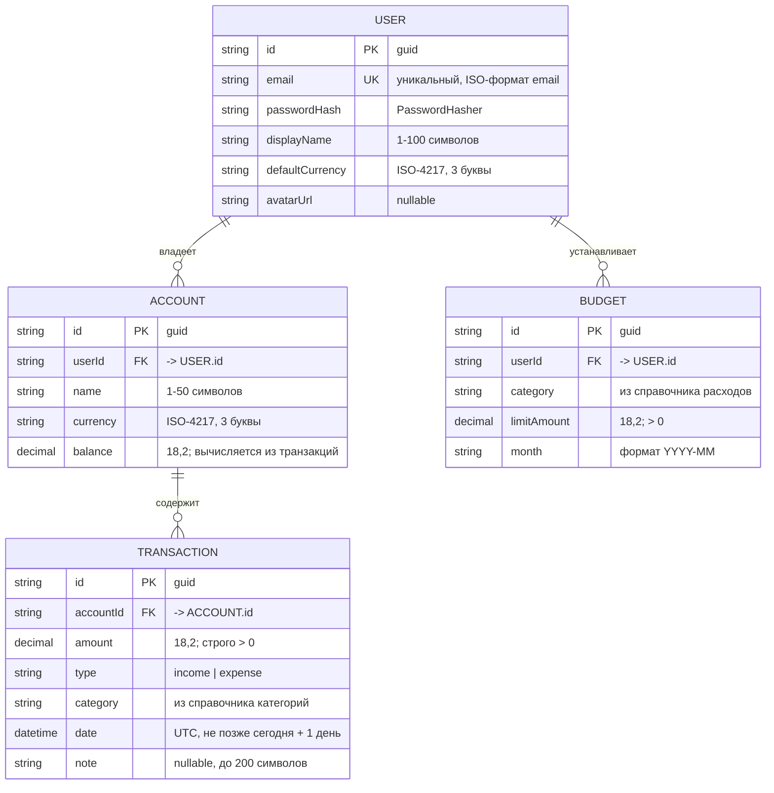

# Модель данных WalletMate

Документ описывает сущности, их поля, связи и ограничения. Он — источник истины для
EF Core-сущностей backend-а (L5) и для drift-таблиц локальной БД (L6).

---

## ER-диаграмма

**Кардинальность связей**

| Связь | Тип | Смысл |
|---|---|---|
| `User` → `Account` | 1 : N | У пользователя может быть сколько угодно счетов, счёт принадлежит одному пользователю |
| `Account` → `Transaction` | 1 : N | Транзакция всегда привязана ровно к одному счёту |
| `User` → `Budget` | 1 : N | Бюджеты задаются пользователем по категориям на месяц |

`Transaction` связана с `User` транзитивно, через `Account`. Отдельного `userId`
в транзакции нет: владелец определяется по счёту, и все выборки на backend-е
фильтруются через `join` со счетами текущего пользователя.

---

## Поля и ограничения

### User

| Поле | Тип | Ограничения |
|---|---|---|
| `id` | string (guid) | PK |
| `email` | string | обязательно, уникально, валидный email |
| `passwordHash` | string | обязательно; чистый пароль нигде не хранится |
| `displayName` | string | обязательно, 1–100 символов |
| `defaultCurrency` | string | ISO-4217, 3 заглавные буквы (`MDL`, `EUR`, `USD`) |
| `avatarUrl` | string? | необязательно; заполняется после загрузки аватара (L5) |

### Account

| Поле | Тип | Ограничения |
|---|---|---|
| `id` | string (guid) | PK |
| `userId` | string | FK → `User.id`, обязательно |
| `name` | string | обязательно, 1–50 символов, уникально в пределах пользователя |
| `currency` | string | ISO-4217, 3 заглавные буквы |
| `balance` | decimal(18,2) | вычисляемое значение; на mock-этапах L2–L4 хранится как поле |

### Transaction

| Поле | Тип | Ограничения |
|---|---|---|
| `id` | string (guid) | PK |
| `accountId` | string | FK → `Account.id`, обязательно |
| `amount` | decimal(18,2) | **строго > 0**, не более 2 знаков после запятой, ≤ 1 000 000 |
| `type` | enum | `income` \| `expense`; знак операции задаётся типом, не знаком суммы |
| `category` | string | обязательно, значение из справочника, согласованное с `type` |
| `date` | datetime (UTC) | обязательно, не позже «сегодня + 1 день» |
| `note` | string? | необязательно, до 200 символов |

### Budget

| Поле | Тип | Ограничения |
|---|---|---|
| `id` | string (guid) | PK |
| `userId` | string | FK → `User.id`, обязательно |
| `category` | string | обязательно, из справочника расходов |
| `limitAmount` | decimal(18,2) | > 0 |
| `month` | string | формат `YYYY-MM` |

---

## Индексы и ограничения целостности

| Объект | Тип | Назначение |
|---|---|---|
| `User(email)` | UNIQUE | Один аккаунт на адрес, ошибка 409 при повторной регистрации |
| `Budget(userId, category, month)` | UNIQUE | Один бюджет на категорию в месяц, ошибка 409 при дубликате |
| `Transaction(accountId, date)` | INDEX | Основной сценарий выборки: операции счёта за период, сортировка по дате убыв. |
| `Account(userId)` | INDEX | Список счетов пользователя и фильтрация транзакций по владельцу |
| `Account` → `Transaction` | ON DELETE CASCADE | Удаление счёта удаляет его транзакции; в UI обязательно подтверждение |
| `User` → `Account`, `User` → `Budget` | ON DELETE CASCADE | Удаление пользователя убирает все его данные |

---

## Вычисляемые величины

Эти значения **не хранятся** в базе, а считаются при запросе (на backend-е — в
агрегатах `/budgets` и `/dashboard/summary`, на mock-этапах — в производных провайдерах).

| Величина | Формула |
|---|---|
| Баланс счёта | `Σ amount(type = income) − Σ amount(type = expense)` по транзакциям счёта |
| Расход по категории за месяц | `Σ amount` транзакций с `type = expense`, данной категорией и `date` внутри месяца |
| Прогресс бюджета | `spentAmount / limitAmount` |
| Доля категории (`share`) | `amount категории / общая сумма расходов за месяц` |

**Пороги выделения бюджета**

| Прогресс | Состояние | Цвет |
|---|---|---|
| < 0.9 | норма | штатный цвет темы |
| ≥ 0.9 и < 1.0 | предупреждение | жёлтый |
| ≥ 1.0 | превышение | красный |

Границы 0.9 и 1.0 включающие — граничные случаи 89.9 % / 90 % / 100 % покрываются
unit-тестами на L4.

---

## Справочник категорий

Справочник зашит в приложении и одинаков на клиенте и сервере.

| Тип | Значения |
|---|---|
| Расходы (`expense`) | `food`, `transport`, `housing`, `utilities`, `health`, `education`, `entertainment`, `shopping`, `other` |
| Доходы (`income`) | `salary`, `scholarship`, `freelance`, `gift`, `other` |

Ключи категорий хранятся на английском; русские подписи берутся из ARB-файлов
локализации, чтобы на бонусном этапе добавить RO и EN без миграции данных.
