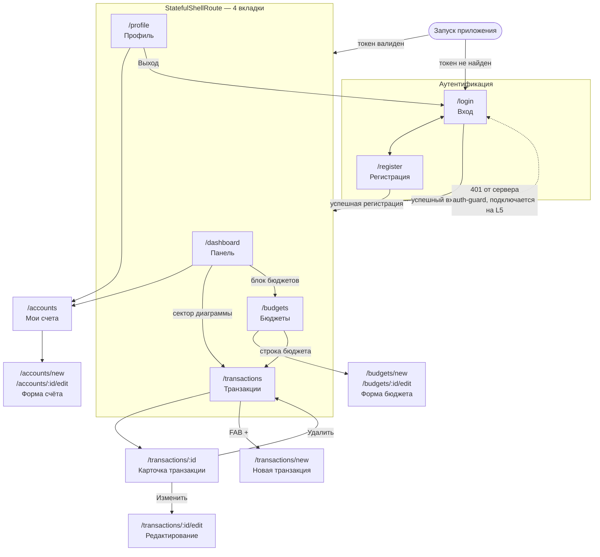

# Карта экранов WalletMate

Приложение состоит из **8 обязательных экранов**. Четыре из них — вкладки нижней
навигации (`NavigationBar`): **Панель**, **Транзакции**, **Бюджеты**, **Профиль**.
Остальные открываются поверх вкладок как дочерние маршруты.

Колонка «Маршрут» — пути `go_router`, которые подключаются на этапе L3. На L2 экраны
существуют, но связаны через `Navigator.push`.

---

## Таблица экранов

| # | Экран | Маршрут | Назначение | Какие данные показывает | Куда ведут переходы |
|---|---|---|---|---|---|
| 1 | Вход / Регистрация | `/login`, `/register` | Аутентификация пользователя, вход по email и паролю или создание аккаунта | Поля email / пароль / подтверждение / имя, ошибки валидации, ссылка-переключатель между входом и регистрацией | Успешный вход → `/dashboard`; «Нет аккаунта?» → `/register`; «Уже есть аккаунт?» → `/login` |
| 2 | Панель (Dashboard) | `/dashboard` | Ответ на вопрос «куда делись деньги в этом месяце»: балансы, структура расходов, состояние бюджетов | Карточки счетов с балансами (горизонтальный скролл), доходы и расходы за месяц, кольцевая диаграмма расходов по категориям с легендой и процентами, список бюджетов с прогрессом (жёлтый ≥ 90 %, красный ≥ 100 %) | Карточка счёта → `/accounts`; блок «Бюджеты» → `/budgets`; сектор диаграммы → `/transactions` с фильтром по категории |
| 3 | Список транзакций | `/transactions` | Просмотр, поиск и фильтрация операций | Транзакции, сгруппированные по датам (сумма со знаком, категория, счёт, заметка), поле поиска, чипы фильтров по категории / типу / периоду, пустое состояние | Элемент списка → `/transactions/:id`; FAB «+» → `/transactions/new` |
| 4 | Карточка транзакции | `/transactions/:id` | Детальный просмотр одной операции | Сумма крупно, тип (доход / расход), категория, счёт, дата, заметка | «Изменить» → `/transactions/:id/edit`; «Удалить» → диалог подтверждения → назад на `/transactions` |
| 5 | Форма транзакции | `/transactions/new`, `/transactions/:id/edit` | Создание и редактирование операции | Поле суммы, переключатель доход / расход, выбор категории, выбор счёта, выбор даты, заметка, кнопка сохранения (неактивна при невалидной форме) | Сохранение → назад на `/transactions` (или на `/transactions/:id` при редактировании) со `SnackBar`; выход с изменённой формы → диалог подтверждения |
| 6 | Мои счета | `/accounts`, `/accounts/new`, `/accounts/:id/edit` | Управление счетами пользователя | Список счетов: имя, валюта, текущий баланс; форма счёта: имя, валюта, начальный баланс | «+» → `/accounts/new`; элемент списка → `/accounts/:id/edit`; «Удалить» → диалог с предупреждением о каскадном удалении транзакций |
| 7 | Месячные бюджеты | `/budgets`, `/budgets/new`, `/budgets/:id/edit` | Постановка лимитов по категориям и контроль их расходования | Выбор месяца, список бюджетов: категория, лимит, потрачено, прогресс-бар с цветовым порогом; форма бюджета: категория, лимит, месяц | «+» → `/budgets/new`; элемент списка → `/budgets/:id/edit`; строка бюджета → `/transactions` с фильтром по категории и месяцу |
| 8 | Профиль | `/profile` | Настройки пользователя и выход | Аватар, имя, email, валюта по умолчанию, переключатель темы, (с L6) статус синхронизации | «Мои счета» → `/accounts`; «Выход» → диалог подтверждения → `/login`; статус синхронизации → экран синхронизации (L6) |

Экран ошибки маршрутизации (`errorBuilder`, 404) обязательным не считается и в восьмёрку
не входит, но подключается на L3.

---

## Карта навигации

Пунктирная стрелка — `redirect` в `go_router`: на L3 это заглушка, возвращающая `null`,
на L5 она начинает выкидывать на `/login` при отсутствии или истечении токена.

---

## Состояния экранов

Начиная с L4 каждый экран, читающий данные, обрабатывает четыре состояния.

| Состояние | Что показываем |
|---|---|
| `loading` | Скелетоны карточек или индикатор загрузки, без блокирующего диалога |
| `error` | Сообщение об ошибке и кнопка «Повторить»; для сетевых ошибок — отдельный текст «Нет соединения» |
| `data` (пусто) | `EmptyState`: иконка, поясняющий текст и кнопка действия («Добавить транзакцию», «Создать бюджет») |
| `data` | Основной контент экрана |

С L6 добавляется офлайн-слой: баннер «Офлайн — изменения синхронизируются позже»
над содержимым и значок «ожидает отправки» на несинхронизированных записях.
